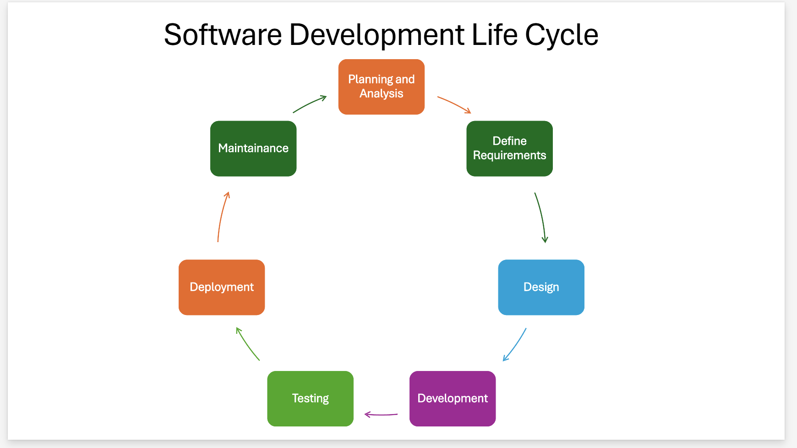

## Project Life Cycle

## Planning & Analysis

 I have decided to create a portfolio website to showcase information about myself, including my education, skills, social media links, and CV. The primary objective of my portfolio website is to provide potential employers, collaborators, and clients with a clear insight  of my skills and the value I can contribute to their teams or projects.

## Define Requirements

This phase transforms the outcomes of the planning and analysis phase into clear, actionable requirements by developing user stories.

## Design

The design phase turns the outcomes of the define requirements phase into real wireframes.
Draw design inspiration from existing portfolios and YouTube tutorials.

## Development

Create a repository on GitHub and clone it locally to begin coding my portfolio website using VSCode, HTML, CSS, and JavaScript. Organize my portfolio website into sections that align with the user stories, and push the changes to the GitHub repository.

## Testing

Conduct tests for HTML, CSS, and JavaScript to identify bugs, assess performance, ensure accessibility, check responsiveness, and verify alignment with user expectations.

## Deployment

Deploy the portfolio website using GitHub and Netlify, then test it again as a live site.

## Maintenance

Fix any bugs and errors that were missed in the earlier testing phase. Additionally, create a README file for the website repository to provide documentation.