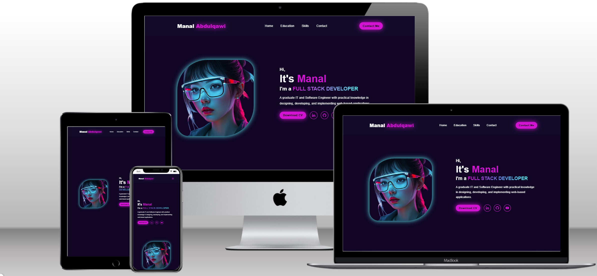
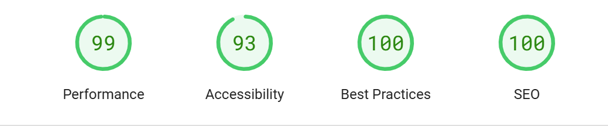
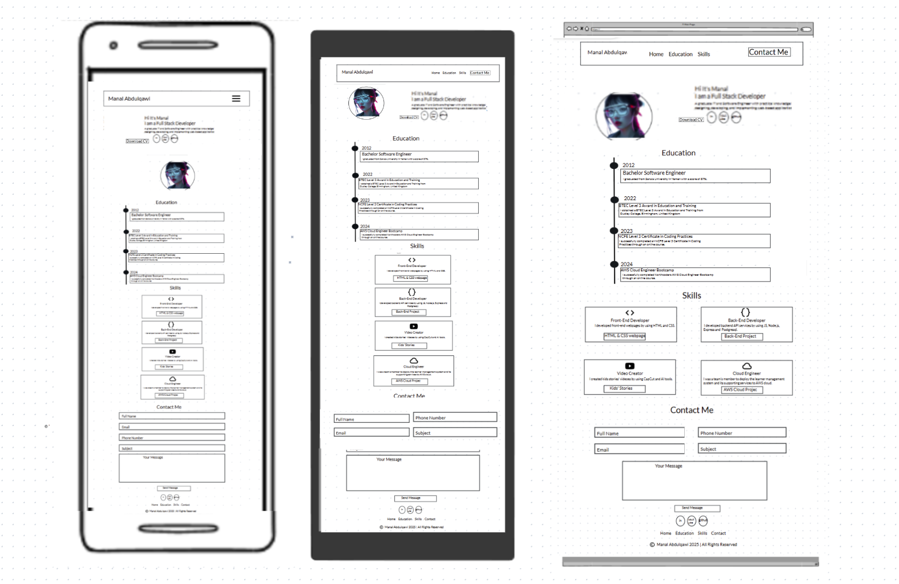

## My Personal Portfolio Website using HTML, CSS, and JS

## Overview

My portfolio website is a static site that provides a comprehensive overview of my background, CV, work availability, education, and skills, along with a contact form. It features a creative, modern, and elegant design.

## Features

1. **Responsive Design:** Adapts seamlessly to various screen sizes and devices for an optimal user experience.
2. **Cutting Edge Design:** Ensures that all elements of the website—such as the logo, navigation, sections, scroll bar, and footer—are crafted in line with the latest trends in portfolio web design.
3. **Interactive Elements:** Includes navigation bar's links,social media icons' links, and footer's links.

## WebPage Details

- **Logo:** Represents my name to indicate that this webpage serves as my portfolio.
- **Navbar:** A navigation bar for seamless access to all page's sections.
- **Introduction Section:** A brief overview about me, including my social media links and view my CV.
- **Education Section:** Timeline cards showcasing my education and the years of achievement.
- **My Skills Section:** Dedicated cards highlighting the variety of my skills, accompanied by relevant icons and links to example projects.
- **Contact Me Section:** Options for users to submit their inquiries to me, including fields for name, email, phone, subject, and message.
- **Footer:** Contains navigation links to all sections of the webpage, along with icons linking to my social media profiles.

## Technologies Used

- **HTML5**: For structuring the webpage content.
- **CSS3**: For styling and enhancing the visual appeal.
- **https://boxicons.com/**: For high quality web icons.
- **JavaScript**: For providing dynamic and interactive functionality for menu icon, allowing navigation through the webpage sections on devices of various sizes.

## Setup and Installation

## Testing

- Accessibility

  - I ran the pages through Lighthouse and confirmed that the colors and fonts are easy to read and that the site is accessible.

  

  - I tested and confirmed that the page works in different browsers; Chrome,and Edge.

- I tested and confirmed that all internal links are working and redirecting the user to the page's sections.
- I tested that all external links, to social media sites, are woking and opening in a separate tab.
- I tested and confirmed that the contact form works, all fields are required, the email field only accepts email address, and the submit button link works:
- HTML - No errors found when running the code through the [W3C HTML Validator](https://validator.w3.org/)
  

- CSS - No errors found when running the code through the [W3C CSS Validator](https://jigsaw.w3.org/css-validator/)
  

## Bugs

- No bugs

## Deployment

### Version Control

- The site was created using Visual Studio Code and pushed to Github to the remote repository.
- Git commands were used throughout the development to push the code to the remote repository. The following git commands were used:
  - git add . - to add the files to the staging area before being committed.
  - git commit -m "commit message" - to commit changes to the local repository queue that are ready for the final step.
  - git push - to push all committed code to the remote repository on Github.

### Deployment to Netlify

- The site was deployed to https://app.netlify.com/:
  - In the main page click on Add new site drop down list ,and choose Import an existing project
  - Choose github, then choose the project repository
  - Give the site name,and choose main for branch to deploy
  - Click Deploy button and wait until the deployment process finish
- The live link: [manalwebsite2025](https://manalwebsite2025.netlify.app/)

### Cloning of the Repository Code locally

- Go to the Github repository that you want to clone
- Click on the Code button located above all the project files
- Click on HTTPS and copy the repository link
- Open the IDE of your choice and and paste the copied git url into the IDE terminal
- The project is now created as a local clone

## Wireframes
-   The initial design and layout of the my potfolio webpage were planned using the marvelapp designing tool. Each wireframe showcases the design across three screen sizes: 895px (mobile), 991px (tablet), and  1285px (desktop).

- Desktop, Tablet, and Mobile Page Wireframe

## Credits
- Special thanks to my mentor, Spencer_ci, and my Lecturer Robert Thompson from Dudley College for their invaluable support and for answering all my questions on Slack and Teams!

### Content
- The icons in the footer and home sections are sourced from [Boxicons](https://boxicons.com/).
- The tab icon is sourced from [favicon.io](https://favicon.io/emoji-favicons/girl)
- The social media links to Github, Youtube, and Linkedin lead to my personal pages.
- The design of the webpage was inspired by this [YouTube tutorial](https://www.youtube.com/watch?v=UqHILyzcULE).

### Media
- The image in the home section was created using AI from [DeepAI](https://deepai.org/).