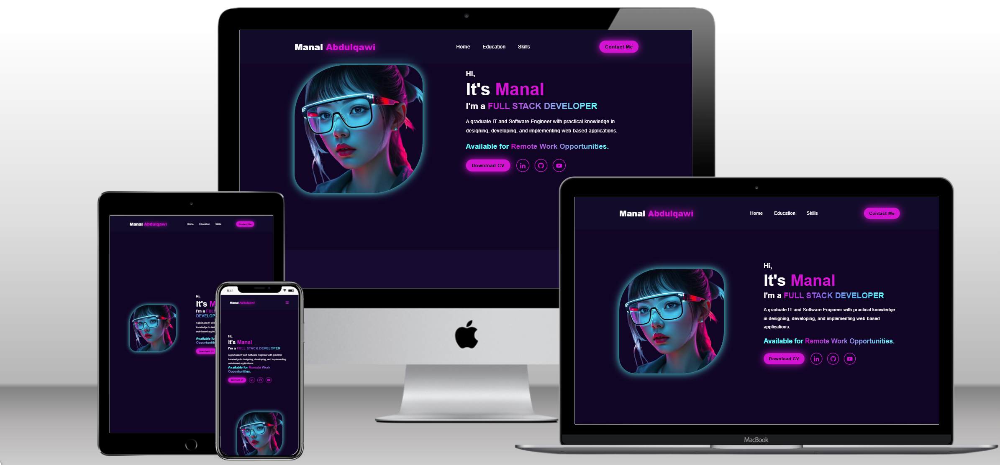

# My Personal Portfolio Website using HTML, CSS, and JS.

## Overview

My portfolio webpage is a static site that offers users a concise overview of my background, education, skills, and includes a contact form. It features a creative, modern, and elegant design.

## Features

1. **Responsive Design:** Adapts seamlessly to various screen sizes and devices for an optimal user experience.
2. **Cutting Edge Design:** Ensures that all elements of the website—such as the logo, navigation, sections, scroll bar, and footer—are crafted in line with the latest trends in portfolio web design.
3. **Interactive Elements:** Includes navigation bar's links,social media icons' links, and footer's links.

## WebPage Details

- **Logo:** Represents my name to indicate that this webpage serves as my portfolio.
- **Navbar:** A navigation bar for seamless access to all page's sections.
- **Introduction Section:** A brief overview about me, including how to contact me through the contact button or my social media links.
- **Education Section:** Timeline cards showcasing my education and the years of achievement.
- **My Skills Section:** Dedicated cards highlighting the variety of my skills, accompanied by relevant icons and links to example projects.
- **Contact Me Section:** Options for users to submit their inquiries to me, including fields for name, email, phone, subject, and message.
- **Footer:** Contains navigation links to all sections of the webpage, along with icons linking to my social media profiles.
