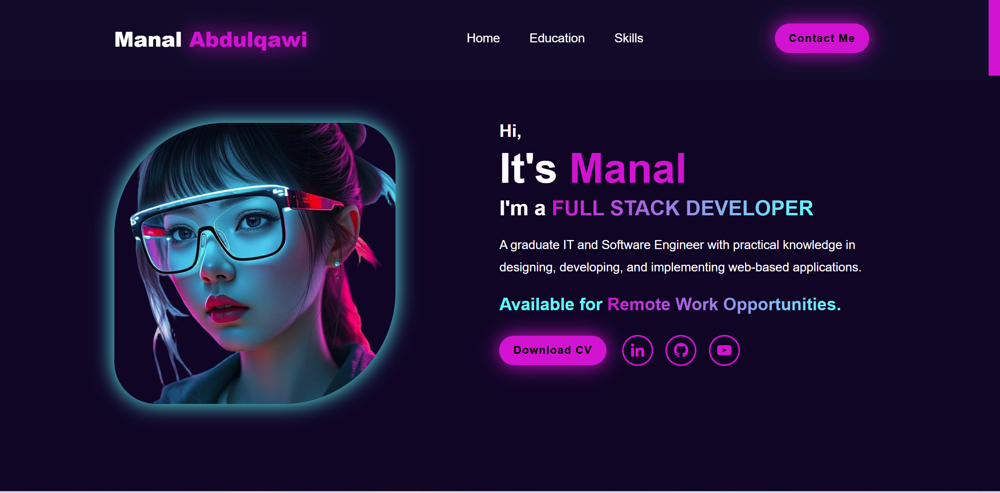
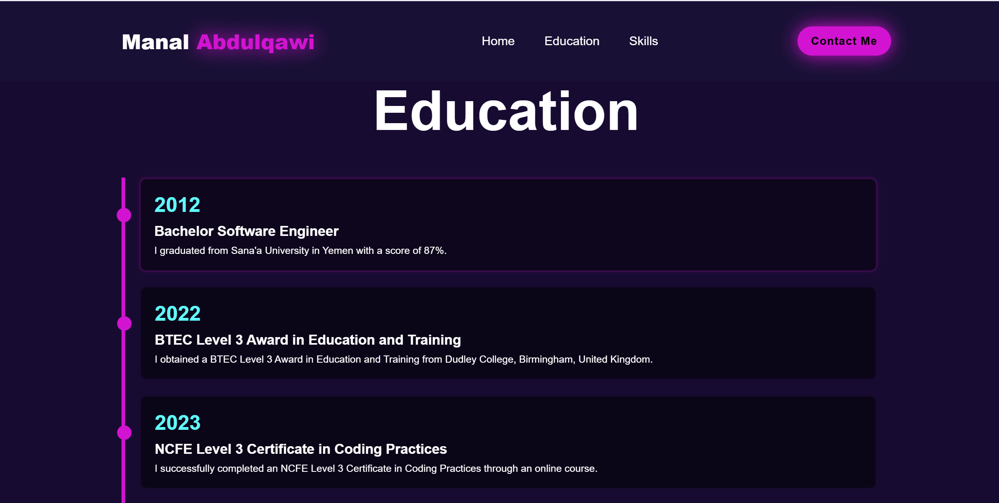
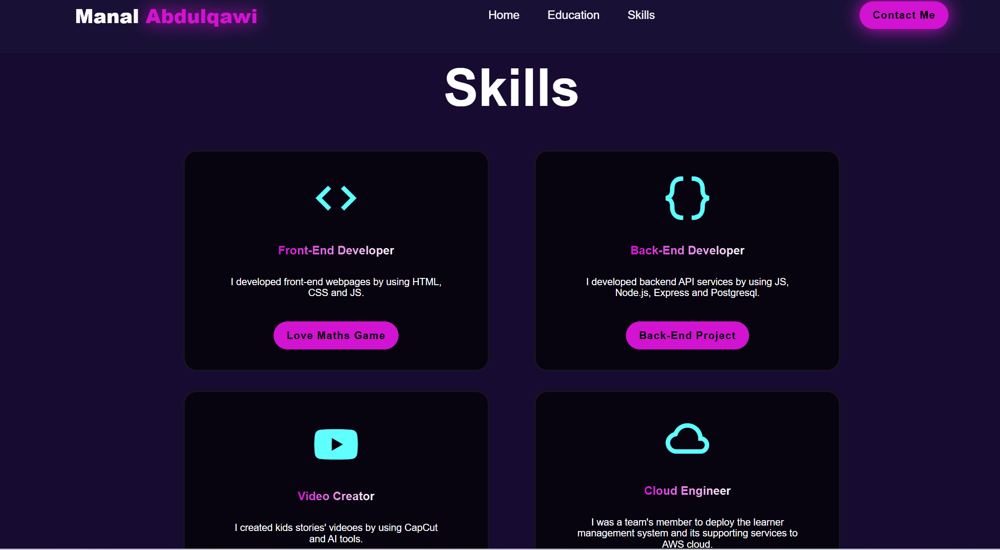
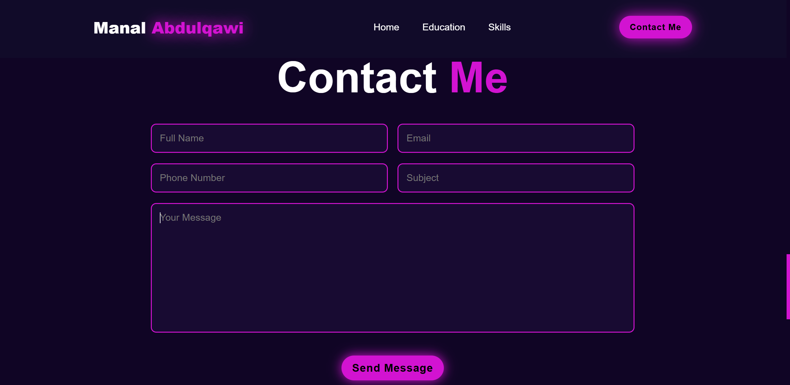
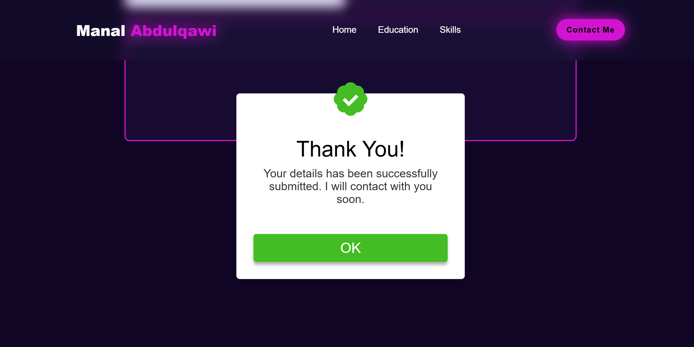
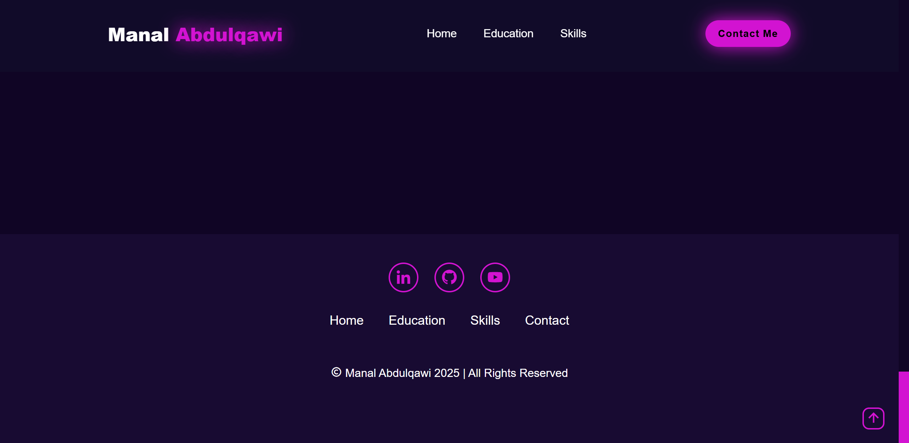

# Project Planning Demo User Stories

## User Story 1
- **Feature Title:** Create the Navbar and Home Section
- **User Story:** I want to understand the purpose of the website and how to navigate through it.
- **Acceptance Criteria:** 
    - The navbar is fixed and displays my name as a logo and links for navigation between sections.
    - The home section provides a brief introduction about me, a link to download my CV, and links to my social media profiles.
    - The navbar and home section are responsive and look good on all main device sizes.

- **Tasks:** 
    - Add HTML for navbar and home section with their content.
    - Style the navbar and home section.
    - Achieve responsiveness by adding media queries to the CSS file for navbar and home sections.

## User Story 2
- **Feature Title:** Education Section
- **User Story:** As a potintial employer I want to know about your educational background.
- **Acceptance Criteria:** 
    - The education section presents a vertical timeline showcasing my years of education, the titles of my degrees, and a brief description of each.
    - The education section is responsive and looks good on all main device sizes.

- **Tasks:** 
    - Add HTML for education section.
    - Style the education section. 
    - Populate the education section timeline cards with education's years, the titles of my degrees, and a brief description of each.
    - Achieve responsiveness by adding media queries to the CSS file for education section.

## User Story 3
- **Feature Title:** Skills Section
- **User Story:** As a potintial employer, collaborator and client I want to gain insight into your skills and the projects you have worked on.
- **Acceptance Criteria:** 
    - The skills section displays skills' cards with icon, content and project example's link for each skill.
    - The skills section is responsive and looks good on all main device sizes.

- **Tasks:** 
    - Create an HTML section for skills that includes four cards, with each card representing a skill, complete with an icon, a brief description, and an example link.
    - Style the skills section.
    - Achieve responsiveness by adding media queries to the CSS file for skills section.

   

## User Story 4
- **Feature Title:** Contact Me Form
- **User Story:**  a potintial employer, collaborator and client,I would like to contact with you.
- **Acceptance Criteria:** 
    - The contact section includes input fields for users to provide their details and messages.
    - The contact section has a submit button that, when clicked, displays a popup message confirming the submission.

- **Tasks:** 
   -  Create the HTML for the form, ensuring each input field is required and formatted correctly.
   - Style the contact me section.
   - Implement JavaScript to display a popup thank-you message when the submit button is clicked.
   - Achieve responsiveness by adding media queries to the CSS file for contact me section.

   

   

## User Story 5
- **Feature Title:** Footer
- **User Story:**  As a user, I want to easily navigate the website from the footer and access your social media links..
- **Acceptance Criteria:** 
    - The footer section includes a section with my social media links. 
    - The footer includes a horizontal list of navigation links to various sections of the website.

- **Tasks:** 
    - Add HTML for the footer section.
    - Style the footer section.
    - Achieve responsiveness by adding media queries to the CSS file for footer section.

